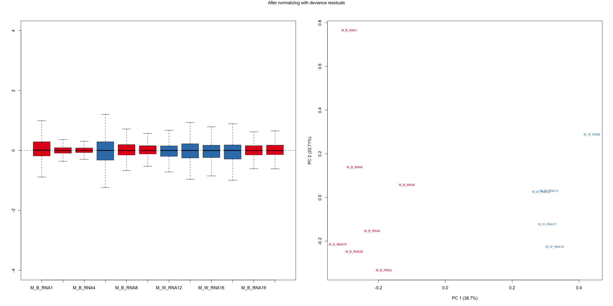

Differentially Expressed Genes in African Americans and Caucasian
Americans With Prostate Cancer
================
Flemming Wu

## Sample information:

- 7 prostate tumor samples from men of African American descent

- 5 prostate tumor samples from men of Caucasian American descent

## Step 1: Read in data and remove lowly expressed genes

## Step 2: Within sample normalization of read counts

Method used: Upper Quartile Normalization (divide counts by the upper
quartile value of the counts)

<!-- -->

## Step 3: Further remove unwanted variation in the data using `RUVSeq`

<!-- -->

## Step 4: Differential expression analysis with `DESeq2`

  

Positive log fold change indicates that the gene is upregulated in
Caucasian Americans compared to African Americans, and negative log fold
change indicates that the gene is upregulated in African Americans
compared to Caucasian Americans.

 

Top 30 genes from `DESeq2` analysis (ranked by BH-adjusted p-value):

| SYMBOL       | baseMean | log2FoldChange | lfcSE |    stat | pvalue               | padj                 |
|:-------------|---------:|---------------:|------:|--------:|:---------------------|:---------------------|
| RPL10P9      |  589.558 |         -6.259 | 0.444 | -14.083 | 4.81701832978508e-45 | 9.53528778380957e-41 |
| RPL10P6      |  188.818 |         -5.902 | 0.524 | -11.269 | 1.8589728527643e-29  | 1.83991838102347e-25 |
| SORD2P       | 1618.885 |         -3.102 | 0.432 |  -7.184 | 6.77860668609978e-13 | 4.47275064504484e-09 |
| SLC27A1      |  346.742 |         -1.175 | 0.165 |  -7.100 | 1.24596913674887e-12 | 6.16598976548598e-09 |
| RNF112       |   62.179 |         -2.764 | 0.430 |  -6.425 | 1.32170525213891e-10 | 4.95198736097242e-07 |
| PLEKHA4      |  105.423 |         -1.724 | 0.269 |  -6.405 | 1.500981266271e-10   | 4.95198736097242e-07 |
| SYT4         |  602.640 |          7.013 | 1.105 |   6.349 | 2.16731888250039e-10 | 6.0658367793834e-07  |
| RNVU1-7      |  527.080 |         -5.351 | 0.845 |  -6.330 | 2.45146219929615e-10 | 6.0658367793834e-07  |
| AHDC1        |  220.244 |         -1.605 | 0.259 |  -6.193 | 5.90352359905624e-10 | 1.29844721825909e-06 |
| RNU1-27P     |  433.953 |         -5.132 | 0.839 |  -6.117 | 9.55392837735385e-10 | 1.89120012229719e-06 |
| CMPK1        | 4121.951 |          1.373 | 0.227 |   6.047 | 1.47479440309731e-09 | 2.65395956448283e-06 |
| GALNT16      |  106.723 |         -1.676 | 0.285 |  -5.887 | 3.94034935652805e-09 | 6.49993462603939e-06 |
| TYMP         |  148.762 |         -1.305 | 0.224 |  -5.833 | 5.44985825132715e-09 | 8.2984572373093e-06  |
| ZBED9        |  409.394 |          1.466 | 0.260 |   5.637 | 1.72553809597052e-08 | 2.43978761498118e-05 |
| SEC61G       |  398.422 |          1.208 | 0.219 |   5.509 | 3.61694933838098e-08 | 4.47484450957821e-05 |
| RP11-66B24.7 |  149.469 |         -2.719 | 0.495 |  -5.491 | 4.00762185447963e-08 | 4.66652203584849e-05 |
| LTBP4        |  677.462 |         -1.513 | 0.277 |  -5.472 | 4.4465657093156e-08  | 4.74556813929949e-05 |
| CRISP3       |  752.360 |          5.382 | 0.984 |   5.468 | 4.55497825949434e-08 | 4.74556813929949e-05 |
| MTND1P23     |  288.861 |         -8.683 | 1.596 |  -5.442 | 5.27794048981603e-08 | 5.07477256109275e-05 |
| KLHL23       |  623.347 |          0.952 | 0.175 |   5.438 | 5.38369405319261e-08 | 5.07477256109275e-05 |
| PIGK         |  916.083 |          1.136 | 0.210 |   5.413 | 6.200956804696e-08   | 5.57945181586169e-05 |
| SLCO1A2      |   76.668 |          4.132 | 0.771 |   5.356 | 8.49354104115981e-08 | 7.30998456129385e-05 |
| HMGB1P5      |   72.250 |         -3.173 | 0.600 |  -5.283 | 1.26774767872229e-07 | 0.000104562772084616 |
| RUSC2        |  329.230 |         -1.192 | 0.226 |  -5.264 | 1.40639878804278e-07 | 0.000111358656037228 |
| LACTB        |  308.251 |          0.918 | 0.175 |   5.246 | 1.55480889017057e-07 | 0.000117101589204297 |
| PGC          |  604.150 |          3.437 | 0.658 |   5.224 | 1.747587569275e-07   | 0.000123548199763566 |
| RN7SL674P    | 1089.489 |         -2.397 | 0.465 |  -5.152 | 2.5836081566669e-07  | 0.000170475078204071 |
| NOTCH4       |  297.878 |         -1.795 | 0.350 |  -5.124 | 2.98985914488944e-07 | 0.000184950818040895 |
| PGGHG        |  271.812 |         -1.863 | 0.368 |  -5.067 | 4.04304648541733e-07 | 0.000234033371576406 |
| KIAA1614     |   50.743 |         -2.097 | 0.414 |  -5.066 | 4.05398545798785e-07 | 0.000234033371576406 |

## Visualization of DE analyis results

<!-- -->

  

<!-- -->

  

## Visualization of Gene Ontology: Biological Pathways gene set enrichment analysis results

Method of calculating statistic for gene ranking: log2FoldChange \*
-log10(p-value)

  

<!-- -->

  

<!-- -->

  

<!-- -->

  

<!-- -->

  

<!-- -->

  

<!-- -->

  

<!-- -->
