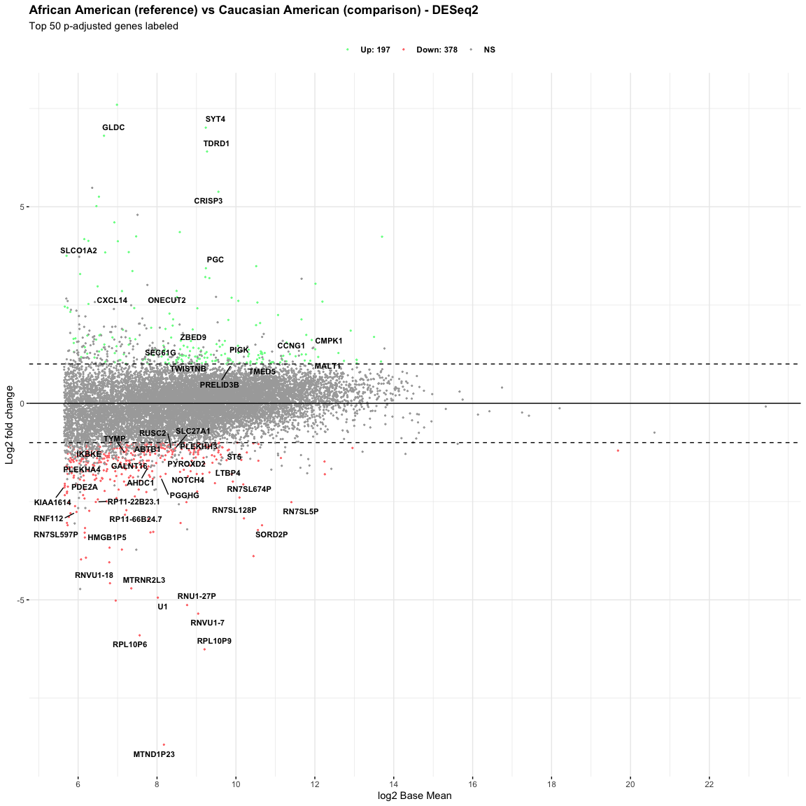
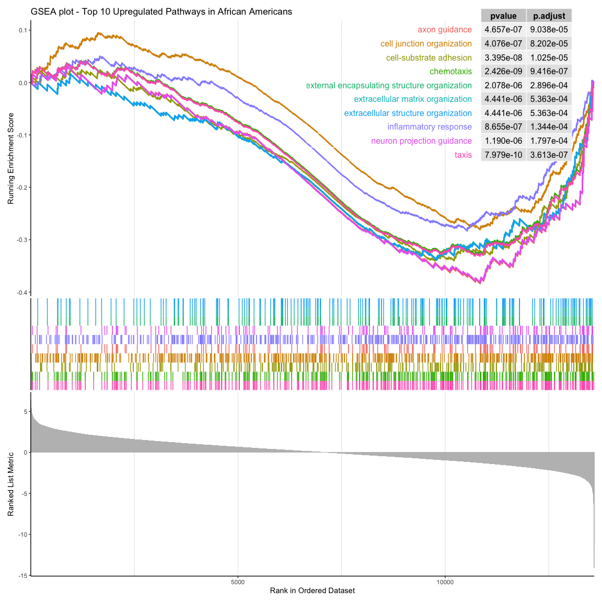

Differentially Expressed Genes in African Americans and Caucasian
Americans With Prostate Cancer
================
Flemming Wu

## Sample information:

- 33 prostate tumor samples from men of African American descent

- 27 prostate tumor samples from men of Caucasian American descent

Top genes:

| SYMBOL        |  baseMean | log2FoldChange | lfcSE |   stat | pvalue               | padj                 |
|:--------------|----------:|---------------:|------:|-------:|:---------------------|:---------------------|
| MIR1184-1     |    63.663 |          3.281 | 0.329 |  9.972 | 2.0190965203306e-23  | 5.61026159139059e-19 |
| MTND4P24      |   241.745 |         -2.630 | 0.271 | -9.694 | 3.18998657390345e-22 | 4.43184834712406e-18 |
| COG3          |  4786.287 |         -0.229 | 0.026 | -8.822 | 1.12565886432534e-18 | 1.04258524013813e-14 |
| ACSM1         |  1013.517 |         -2.118 | 0.248 | -8.537 | 1.38192387973596e-17 | 9.59953423058587e-14 |
| LAYN          |   704.018 |          0.486 | 0.057 |  8.470 | 2.45258294676809e-17 | 1.36294939517796e-13 |
| CACHD1        |  1264.141 |          0.440 | 0.052 |  8.388 | 4.93731222570576e-17 | 2.28646929172434e-13 |
| TMEM173       |  2451.967 |          0.445 | 0.053 |  8.340 | 7.42671241394839e-17 | 2.947980444771e-13   |
| MUC6          |   603.066 |         -5.564 | 0.679 | -8.189 | 2.62615355514517e-16 | 9.12128783540795e-13 |
| RPL7L1        |  7054.140 |         -0.181 | 0.023 | -7.897 | 2.84967769294415e-15 | 8.7979049306829e-12  |
| CANT1         | 13089.444 |         -0.295 | 0.038 | -7.818 | 5.36154223803176e-15 | 1.4897581262595e-11  |
| ERGIC1        | 27443.416 |         -0.313 | 0.040 | -7.781 | 7.20108774813416e-15 | 1.81899476517869e-11 |
| RP11-429J17.7 |    51.585 |         -1.378 | 0.180 | -7.655 | 1.93596152843516e-14 | 4.48271891909161e-11 |
| ARHGEF2       |  1946.491 |          0.333 | 0.044 |  7.620 | 2.54295628187363e-14 | 5.43527563447235e-11 |
| SNX31         |   270.743 |         -2.036 | 0.275 | -7.415 | 1.21537946385629e-13 | 2.41218098447936e-10 |
| UHRF1BP1      |  2467.284 |         -0.301 | 0.041 | -7.361 | 1.82158706439854e-13 | 3.37430787809185e-10 |
| PRPS1         |  1884.976 |         -0.349 | 0.047 | -7.345 | 2.06342927125604e-13 | 3.58340285819502e-10 |
| RP11-561C5.4  |    70.703 |          1.216 | 0.166 |  7.330 | 2.29885954830963e-13 | 3.75741831819596e-10 |
| ZSCAN23       |   301.749 |         -0.523 | 0.072 | -7.316 | 2.54979042760228e-13 | 3.93602649007539e-10 |
| CARD19        |   785.606 |          0.364 | 0.050 |  7.297 | 2.94406854738704e-13 | 4.30546782408927e-10 |
| ACACA         | 10779.049 |         -0.362 | 0.050 | -7.256 | 3.98317929005049e-13 | 5.53383098766714e-10 |
| RPL10P6       |    95.034 |         -1.624 | 0.225 | -7.218 | 5.26305661593296e-13 | 6.96377576811015e-10 |
| TRIM52-AS1    |   264.231 |          0.556 | 0.077 |  7.192 | 6.39640844102057e-13 | 8.07866386100898e-10 |
| ABCC4         | 21324.862 |         -0.974 | 0.136 | -7.165 | 7.79787630296028e-13 | 9.42051265017628e-10 |
| PLEKHA2       |  1746.198 |          0.274 | 0.039 |  7.111 | 1.14844439049329e-12 | 1.3296114930936e-09  |
| ALDH6A1       |  6423.208 |         -0.340 | 0.048 | -7.082 | 1.41851360805357e-12 | 1.56457802339824e-09 |
| MMP14         |  5809.005 |          0.343 | 0.048 |  7.078 | 1.46401168244275e-12 | 1.56457802339824e-09 |
| SOX7          |   202.410 |          0.726 | 0.103 |  7.035 | 1.98630012253125e-12 | 2.04412352609827e-09 |
| SLCO3A1       |   758.773 |          0.516 | 0.074 |  6.984 | 2.86584917539168e-12 | 2.84394589955118e-09 |
| PCBD1         |  2475.619 |         -0.263 | 0.038 | -6.896 | 5.35903365401466e-12 | 5.13469341760177e-09 |
| GRHL2         |  8149.190 |         -0.342 | 0.050 | -6.837 | 8.10320829754674e-12 | 7.32041211582442e-09 |

<!-- -->

  

<!-- -->

  

  

<!-- -->

  

<!-- -->

  

<!-- -->

  

<!-- -->

  

<!-- -->

  

<!-- -->

  

<!-- -->
